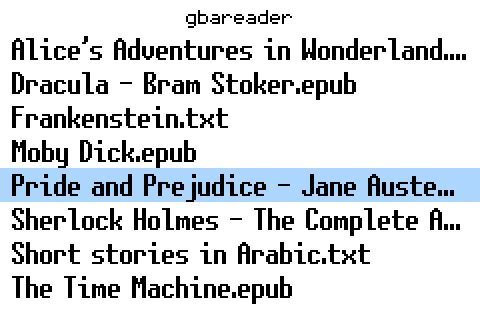
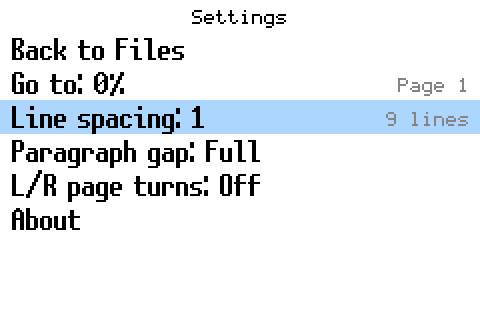
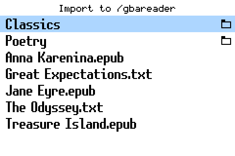
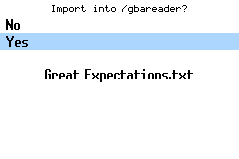

# gbareader V3.1

## Full controls

gbareader is a book reader for the Game Boy Advance. It reads TXT and EPUB books from a Supercard SD card, remembers where you stopped, and shows Latin, Greek, Cyrillic, Japanese, Chinese, Korean and Arabic text.

gbareader is free software (GNU GPL 3.0 or later). Source code: https://github.com/Xinon232/gbareader

## Getting started

1. Copy `gbareader.gba` to your SD card and start it from your Supercard loader.
2. Put your books in the folder `/gbareader` on the card: UTF-8 `.txt` files and `.epub` files. You can also leave them anywhere on the card and import them later with `Start`.
3. Start gbareader. Your books are listed right away, with the cursor on the book you read last.

## Buttons at a glance

| Where | Button | What it does |
| --- | --- | --- |
| Book list | `Up` / `Down` | Move. Hold to scroll. At the first or last book, a new press jumps to the other end. |
| Book list | `Left` / `Right` | One page (eight books) back or forward. |
| Book list | `A` | Open the book. |
| Book list | `Start` | Import books from anywhere on the card. |
| Book list | `Select` | Settings. |
| Reading | `A` or `Right` | Next page. |
| Reading | `B` or `Left` | Previous page. |
| Reading | `Start` | Save your position. |
| Reading | hold `Up` | Turn page turning with `L` / `R` on or off. |
| Reading | `Select` | Settings (and the way back to the book list). |
| Settings | `Up` / `Down` | Choose a row. |
| Settings | `Left` / `Right` or `A` | Change the value, or open the row. |
| Settings | `B` | Close Settings. |
| Import | `A` | Open a folder, or choose a book. |
| Import | `B` | Up one folder; from the top, back to the book list. |
| About | `Left` / `Right` | Turn pages. `B` goes back. |

## The book list

All TXT and EPUB files in `/gbareader` are listed, eight at a time, in the order they are stored on the card. The selected book has a light blue bar; a long name scrolls so you can read all of it. There is no limit on the number of books.

## Reading

- Turn pages with `A` / `Right` (forward) and `B` / `Left` (back).
- Press `Start` to save your position. The screen shows `save...` and then `Saved`. Turning pages does not save by itself.
- Hold `Up` alone for about a second to turn page turning with `L` (back) and `R` (forward) on or off. `L+R: On` or `L+R: Off` appears for a moment. gbareader remembers your choice.
- Press `Select` for Settings.

If you go back right after a jump, the screen may show `Loading back...` for a moment while earlier pages are prepared.

Arabic is shown right to left with joined letters. gbareader checks the page a book opens on: if it contains Arabic, Arabic display is switched on for that book and remembered. If the Arabic only starts later in a book, save on a page with Arabic text (`Start`) and open the book again.

## Settings

Press `Select` to open Settings, from the book list or while reading. The rows:

- `Back to Files`: close the book and return to the book list (only while reading). If the page you are on is not the one you saved last, the row asks `Continue without saving?` first: `A` leaves without saving, `B` keeps the book open.
- `Go to`: jump to a percentage of the book (only while reading). `Left` / `Right` change it by 1% (hold to keep going), `L` / `R` by 10%. `A` jumps at once; closing Settings also jumps. On the right you see the current page number (`Page about ...` while it is still being counted).
- `Line spacing`: 0 to 4 pixels between lines. On the right: how many lines fit on a page.
- `Paragraph gap`: None, Small, Half or Full line between paragraphs.
- `L/R page turns`: On or Off. Same as holding `Up` while reading.
- `About`: version, contact, the most important controls, and the credits.

`B`, `Select` or `Start` close Settings. Your settings apply to every book and are saved on the card.

## Importing books

On the book list, press `Start`. The screen `Import to /gbareader` shows the folders (with a folder symbol) and the TXT and EPUB books of the SD card, starting at the top of the card.

Choose a book with `A`. gbareader asks `Import into /gbareader?`; `No` is selected first. Choose `Yes` to copy the book. The book list then appears with the new book selected and the message `Imported`.

- The original file stays where it was; gbareader makes a copy.
- If `/gbareader` does not exist yet, it is created.
- A book with the same name is never overwritten: you see `Already in /gbareader`.
- If the copy fails, no half-copied file is left behind.

## Files on the card

- Each book gets a small companion file next to it, for example `Title.epub.sav` for `Title.epub`. It holds your position, earlier pages for going back, the Arabic setting and, for EPUB books, a prepared copy of the text. Your book files are never changed.
- `SETTINGS0.DAT` and `SETTINGS1.DAT` in `/gbareader` hold your settings and the last book you opened.
- When you rename or move a book on a computer, rename or move its `.sav` file with it. Deleting a `.sav` file only loses the saved position; the book still opens.
- An EPUB can show `Preparing cache...` the first time you open it. This happens once.

## Messages

| Message | Meaning |
| --- | --- |
| `Saved` | Your position and settings were saved. |
| `Position save failed` | The position could not be saved. Stay in the book and press `Start` again. |
| `Settings save failed` | Your settings could not be saved yet. They are tried again on the next save. |
| `Both saves failed` | Neither could be saved. Check the card and try `Start` again. |
| `No books found` | `/gbareader` is empty or missing. Press `Start` to import books. |
| `No SD card` | The card could not be read. |
| `Settings recovered` | One copy of the settings was damaged; the other one was used. |
| `Settings load failed` | The settings could not be read; defaults are used. |

## Good to know

- EPUB books are shown as text only: no pictures, special layouts or DRM-protected books.
- TXT files must be UTF-8 (plain ASCII is fine too).
- Books must be directly in `/gbareader`; subfolders there are not listed. To save positions, a book's file name can be at most 251 bytes long.
- Do not switch off the GBA or remove the card while `save...`, `Preparing cache...` or `Importing...` is shown. Keep a backup of your books.
- This version has not been tested on every card and Supercard model yet.

## Credits and licenses

Made by Halim Jarrar, (C) 2026. Website: https://halimj.itch.io - Contact: gba@halim-jarrar.de

gbareader is free software under the GNU GPL v3 or later. Source code: https://github.com/Xinon232/gbareader

gbareader builds on the work of others:

| Part | Made by | License |
| --- | --- | --- |
| SuperFW font rendering and font packs | David Guillen Fandos | GPL v3 or later. The UNSCII-based pack includes GNU Unifont and public-domain Fixedsys Excelsior glyphs. |
| Ghoulam Arabic pixel font | (C) 2025 Imad AlFil / mloukhiyye | CC BY 4.0 |
| Butano game engine | Gustavo Valiente | zlib |
| FatFs | ChaN | permissive license |
| The decompression part of miniz | Rich Geldreich and others | MIT |

The Ghoulam font was converted to fit the Game Boy screen. This conversion is not endorsed by the font's author. Font: https://mloukhiyye.itch.io/ghoulam-arabic-pixel-art-font-version-1 - License: https://creativecommons.org/licenses/by/4.0/

Butano: https://github.com/GValiente/butano

The credits are also shown in the app under Settings > About.
